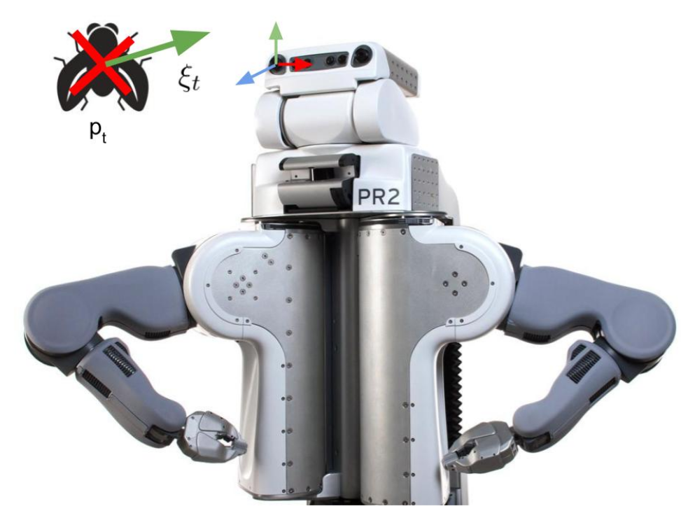
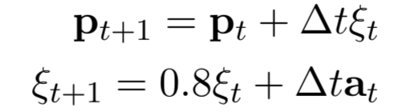
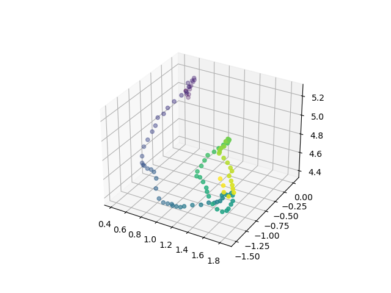
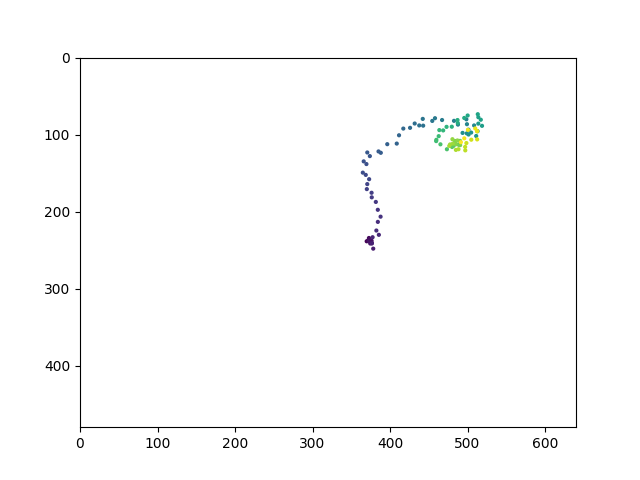
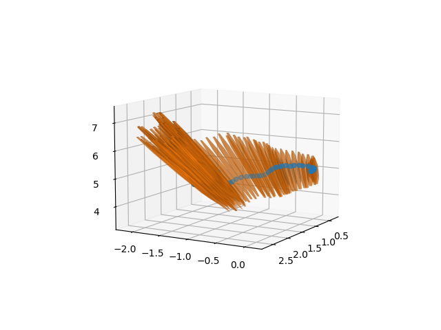
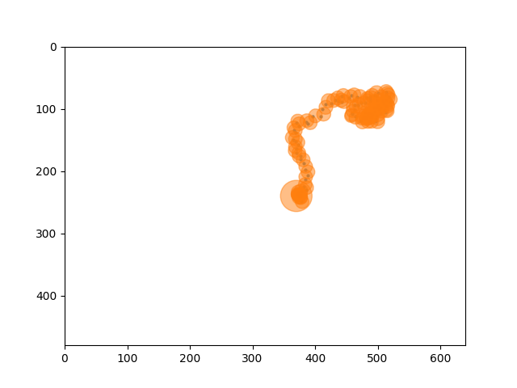

# Fly Tracking from 2D Observations in Image Plane using an EKF

Consider the scenario depicted in the figure where a robot tries to catch a fly that it tracks visually with its cameras. 



To catch the fly, the robot needs to estimate the 3D position and linear velocity of the fly with respect to its camera coordinate system. The fly is moving randomly in a way that can be modelled by a discrete time double integrator.



The vision system of the robot consists of (unfortunately) only one camera. With the camera, the robot can observe the fly and receive noisy measurements `z` which are the pixel coordinates `(u,v)` of the projection of the fly onto the image. 

We assume a known 3x3 camera intrinsic matrix:  

```
K = [[500, 0, 320],
     [0,   0, 500],
     [240, 0 ,0  ]]

```

Initially, the fly is sitting on the fingertip of the robot when it is noticing it for the first time. Therefore, the robot knows the fly's initial position from forward kinematics to be at `p0 =(0.5, 0, 5.0)` (resting velocity). Trajectory of the fly has been simulated with added noisy observations for this problem.

Simulated fly's trajectory  | 2D Observation 
:----------------------------:|:-------------------------:
  |  

Tracking this fly in 3D using 2D observations require us to find the Jacobian of the observation model with respect to the fly's state which can then be used by an Extended Kalman Filter to estimate the position and velocity of the fly relative to the camera.

Estimated fly's trajectory with covariance  | 2D projection of estimated trajectory with covariance
:----------------------------:|:-------------------------:
  |  
